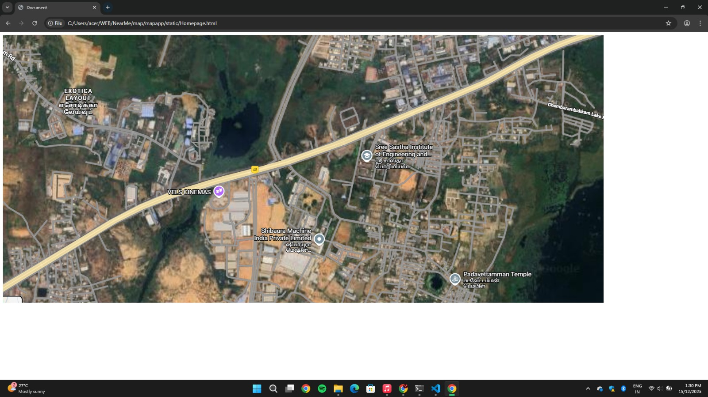
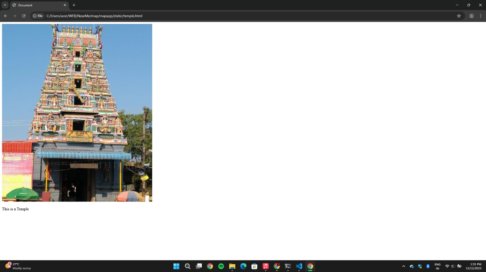
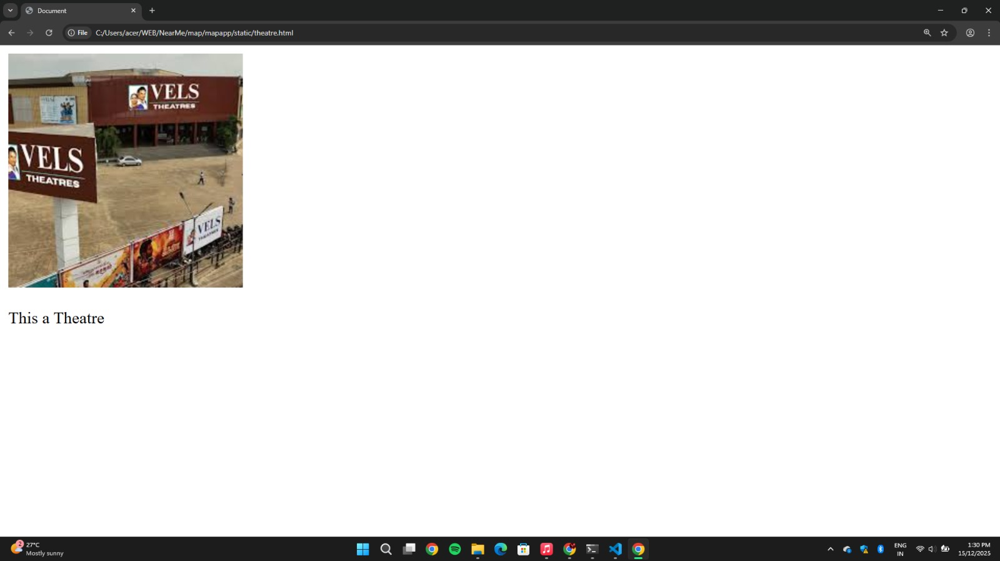
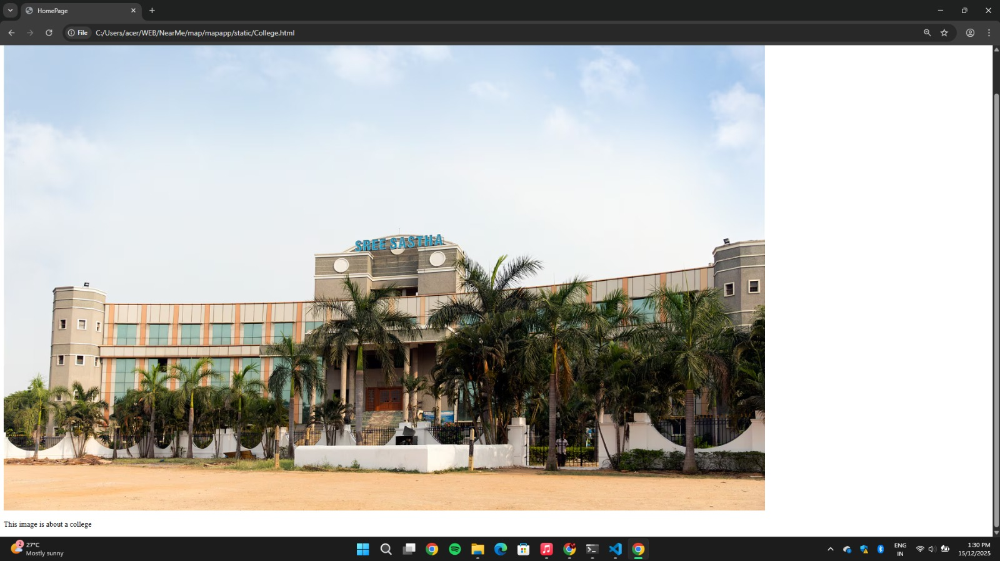

# Ex04 Places Around Me
## Date: 24-12-2025

## AIM
To develop a website to display details about the places around my house.

## DESIGN STEPS

### STEP 1
Create a Django admin interface.

### STEP 2
Download your city map from Google.

### STEP 3
Using ```<map>``` tag name the map.

### STEP 4
Create clickable regions in the image using ```<area>``` tag.

### STEP 5
Write HTML programs for all the regions identified.

### STEP 6
Execute the programs and publish them.

## CODE
```
(HomePage)
<!DOCTYPE html>
<html lang="en">
<head>
    <meta charset="UTF-8">
    <meta name="viewport" content="width=device-width, initial-scale=1.0">
    <title>Document</title>
</head>
<body>
    <!-- Image Map Generated by http://www.image-map.net/ -->


<map name="image-map">
    <area target="" alt="theater" title="theater" href="theatre.html" coords="540,397,613,462" shape="rect">
    <area target="" alt="College" title="College" href="College.html" coords="1019,344,112" shape="circle">
    <area target="" alt="Temple" title="Temple" href="temple.html" coords="1148,596,1433,603,1435,689,1184,695" shape="poly">
</map>
</body>
</html>

(Temple)
<!DOCTYPE html>
<html lang="en">
<head>
    <meta charset="UTF-8">
    <meta name="viewport" content="width=device-width, initial-scale=1.0">
    <title>Document</title>
</head>
<body>
    
    <p>This is a Temple</p>
</body>
</html>

(Theatre)
<!DOCTYPE html>
<html lang="en">
<head>
    <meta charset="UTF-8">
    <meta name="viewport" content="width=device-width, initial-scale=1.0">
    <title>Document</title>
</head>
<body>
    
    <p>This a Theatre</p>
</body>
</html>

(College)
<!DOCTYPE html>
<html lang="en">
<head>
    <meta charset="UTF-8">
    <meta name="viewport" content="width=device-width, initial-scale=1.0">
    <title>HomePage</title>
</head>
<body>
    
    <p>This image is about a college</p>
    
</body>
</html>
```

## OUTPUT


## RESULT
The program for implementing image maps using HTML is executed successfully.
